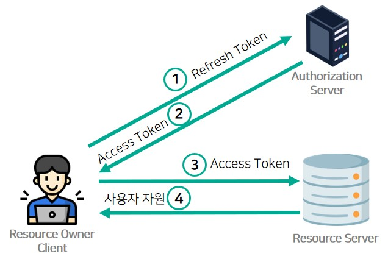
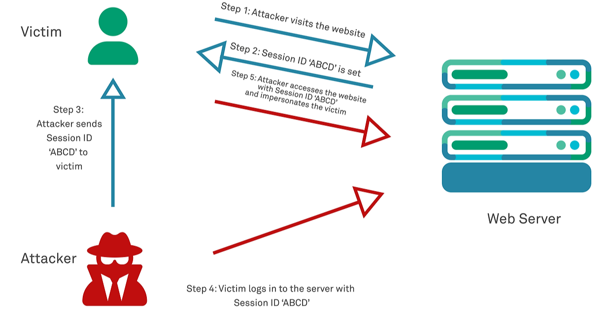

# 01 웹보안 기초상식 쌓기 part.01

보안/웹 트랙 활동을 위해 사전 스터디를 시작하려 했는데 `인증/인가 처리 미흡`, `JWT, 세션 처리 취약점`, `입력값 검증 부족`, `CORS 설정 오류`, `CSRF 대응 미비`, `보안 Header 설정 미흡`, `로그 관리 실수`, `환경변수 관리 문제` 등의 주제가 있는 것을 보게 되었다.

이들 중 몇몇은 기존에 알고 있었지만, 정확히는 몰랐고, `CSRF`, `보안 Header`등은 처음 들어본 말들이였다. 

그래서 이 기회에 각각이 무엇인지, 어떤 부분을 조심해야 하는지 알아보고자 한다. 전부 하루에 알아보기엔 너무 많으므로, 약 3일로 나누어 알아보고, 기존 프로젝트도 분석해보고자 한다.

## 1. 인증/인가 처리 미흡

> 참고자료
> - [불충분한 인증, 인가 취약점이란?](https://studysteadily.tistory.com/47)
> - [인증 / 인가 취약점](https://velog.io/@serious56/%EC%9D%B8%EC%A6%9D-%EC%9D%B8%EA%B0%80-%EC%B7%A8%EC%95%BD%EC%A0%90)

**인증/인가 처리 미흡**은 인증이 필요한 페이지에 인증처리 소스코드 로직의 결함으로 인해 공격자가 적절한 인증처리를 수행하지 않고  중요한 자원(관리자 페이지, 내부 게시판, 기밀 데이터 등)에 접근할 수 있게 되는 취약점이다. 

### 1.1. 인증 취약점

세션 쿠키 설정이 미흡한 경우 인증 정보를 탈취당할 수 있다. 이는 `JWT, 세션 처리 취약점`의 내용인 것 같다. 쿠키는 클라이언트에 저장되므로, 공격자가 자바스크립트 등을 이용해 쉽게 탈취할 수 있다. 그러므로 저장할 때 `http-only`나 `Secure`등의 옵션을 적용해 세션/쿠키를 지켜야 한다.

다음으로, **프로세스 건너뛰기**가 있다. 회원가입이나 본인인증 절차가 (1)약관 동의 → (2)본인인증 → (3)회원가입 순서로 진행되는데, URL 조작으로 (2)를 건너뛰고 직접 (3)페이지에 접근할 수 있는 경우가 있다. 인증 로직이 서버에서 단단히 체크되지 않으면, 간단한 URL 변조만으로 절차를 우회할 수도 있다.

게시글 번호나 사용자 ID등 웹서버로 전송되는 모든 HTTP 요청 값(URL Parameter, Cookie, Referer, form 변수, hidden 필드, User-Agent 등)을 조작하여 정상적으로는 접근 권한이 없는 정보를 조회/변경하는 공격이 있다. 이를 **파라미터 변조**라고 한다. 인증·인가 로직이 URL 파라미터에만 의존하고 별도의 서버 검증이 없다면, 공격이 성립되므로, 꼭 서버측에서 검증을 해야 한다.
 
인증 횟수에 제한을 하지 않은 경우도 있다. 이 경우 **브루트-포스 공격(무차별 대입)**이 가능해진다. 브루트-포스 공격 관련해서 찾아보다 얼마전 벨로그에서 봤던 한 글이 생각났다. [클라이언트측 보안은 절대로 깨진다](https://velog.io/@parallelkim/client-decryption)라는 글이다. 이 글에선 국내 모 금융 서비스에서 거래내역서를 받아보았는데, 비밀번호가 걸린 HTML을 받았고, 그 비밀번호 검증이 클라이언트 측에서 이루어지며, 횟수제한이 없다는 것을 발견했다. 그래서 즉시 브루트-포스 스크립트를 짜서 약 30초 만에 원본 내용을 확인했다는 내용이였다.

### 1.2. 인가 취약점

공격자가 관리자로 로그인하지 않은 상태에서 관리자 페이지의 URL을 직접 입력하거나, 약관 동의  절차 중 특정 페이지의 URL을 알고 그 페이지로 이동하여 절차를 점프하는 경우가 있다. 이를 **URL 직접 접근**이라 한다. 사이트 내부 관리 페이지는 `/admin`, `/manage` 같은 특정 규칙을 가지므로 URL을 예측해서 접근을 시도한다.

위 예시중 하나로, 관리자 전용 페이지가 여로 경로로 나누어져 있고, 특정 경로에는 권한 체크 로직을 생략한 경우도 있다.

**주석, CSS를 통해 접근 제한**을 해놓거나, **자바스크립트만으로 막아놓아** 취약해지는 경우도 있다. “권한이 없으면 alert() 띄우고 버튼 비활성화”처럼 클라이언트(자바스크립트) 쪽에서만 검증을 하거나 중요 버튼을 HTML 주석 처리, CSS로 `display:none;`만 적용해 감춰놓고 “권한 제한”이라고 생각하는 경우, 소스 코드를 열어 특정 부분을 수정하면 민감한 정보에 접근할 수 있다. 이를 막기 위해서 권한 체크는 항상 서버에서 수행해야 한다.

### 1.3. 생각

- 인증과 인가는 밀접한 관계라 어떤 취약점이 인증 취약점이고, 어떤 취약점이 인가 취약점인지 분류하는데 조금 어려웠다. 중요한건 분류보다, 어떤 취약점들이 있고, 어떻게 막아야 하는지라고 생각한다.
- **인증/인가 취약점**에 대해 알아보며, 클라이언트는 항상 위변조에 노출되어있고, 서버에서 항상 클라이언트를 의심하며 검증을 해야한다는 것을 느꼈다. 물론, 클라이언트의 보안을 신경쓰지 말자는 말은 아니다. 다만, 막상 알아보니 클라이언트 위변조가 생각보다 쉬워서 조금 경각심을 갖게 되었다.

## 2. JWT, 세션 처리 과정에서 자주 발생하는 취약점

> 참고자료
> - [Spring Security: Part2. OAuth 2.0 아키텍처 이해와 보안 취약점 사례](https://www.igloo.co.kr/security-information/spring-security-part2-oauth-2-0-%EC%95%84%ED%82%A4%ED%85%8D%EC%B2%98-%EC%9D%B4%ED%95%B4%EC%99%80-%EB%B3%B4%EC%95%88-%EC%B7%A8%EC%95%BD%EC%A0%90-%EC%82%AC%EB%A1%80/)
> - [세션 고정 취약점](https://velog.io/@inmo/%EC%84%B8%EC%85%98-%EA%B3%A0%EC%A0%95-%EC%B7%A8%EC%95%BD%EC%A0%90)

웹 애플리케이션에서 **로그인** 기능을 구현할 때, 대부분 **JWT**(JSON Web Token)나 **세션(Session)** 기반 인증 방식을 사용한다.
하지만 이들을 잘못 다루면 **심각한 보안 취약점**으로 이어질 수 있다. JWT와 세션 처리 시 주의해야 할 취약점과 대응 방안을 함께 알아보겠다. 
로그인을 관리하는 주체는 서버지만, 로그인 정보를 보관하는 주체는 클라이언트이므로 프론트엔드 개발자나 서버개발자나 모두 이 문제에 대해 숙지하고 있어야 한다고 생각한다.

### 2.1. JWT 취약점

#### 1) 서명 검증 미흡 (`alg=none` 등)

JWT는 크게 **헤더(alg, typ)** + **페이로드** + **서명**으로 구성되는데,  
공격자가 토큰의 **알고리즘(alg)을 `none`**으로 지정하거나, **위·변조된 서명**을 주입했음에도 서버가 제대로 검증하지 않으면, 유효하지 않은 토큰으로도 인증이 통과되는 상황이 벌어질 수 있다.

- 서버에서 **알고리즘(alg)을 고정**하거나, 발행 시점을 확인해 **서명 검증**을 철저히 해야 한다.
- JWT 검증 로직을 직접 구현하기보다는, **검증 라이브러리**를 사용해 처리해야 한다.

#### 2) 토큰 만료 예외 처리 부실

JWT에는 만료 시간을 나타내는 `exp` 필드가 존재하지만, 서버에서 이를 체크하지 않는다면 토큰이 **무기한** 사용될 수 있어 위험하다.

- 서버에서 **`exp` 필드**를 꼭 확인하고, 만료된 토큰은 **인증 거부**해야 한다.  
- **짧은 만료 시간을 가진 Access Token**과 **별도의 Refresh Token**을 함께 사용해, 토큰을 정기적으로 재발급받도록 설계하면 더 안전하다.

#### 3) 토큰 강제 무효화(로그아웃) 어려움

JWT의 **Stateless**한 특성 때문에, 특정 사용자를 강제 로그아웃시키는 일이 간단치 않다.  
이미 발행된 토큰은 클라이언트가 보관하고 있으므로, 서버에서 별다른 조치를 하지 않는 이상 계속 사용될 우려가 있다.

- **Blacklist** 또는 **Whitelist**를 운영해 토큰을 저장·관리하고, 유효성을 매 요청마다 확인한다.  
- 또는 **Redis**와 같은 캐싱 서버를 사용해, 만료 or 해지된 토큰을 기록하고 인증 과정에서 참조하도록 한다.

#### 4) 저장 위치(`localStorage`, `sessionStorage` 등)의 문제

브라우저에서 JWT를 **`localStorage`**나 **`sessionStorage`**에 보관할 경우, **XSS**(스크립트 삽입 공격)로 토큰이 탈취될 우려가 크다. 그러므로

1. **`httpOnly` 쿠키**로 토큰을 주고받아, 자바스크립트로 토큰에 직접 접근할 수 없도록 해야 한다.
2. 가능하다면 **`Secure`**, **`SameSite`** 속성도 함께 설정해 CSRF(크로스사이트 요청 위조) 등의 위험을 줄여야 한다.

#### 5) 액세스(Access) - 리프레시(Refresh) 토큰 구조

위의 문제들을 해결하기 위해 나온 형식이 있다. 바로 **액세스(Access) - 리프레시(Refresh) 토큰 구조**이다.

- **Access Token**: 만료 시간이 짧지만, 요청마다 **서버 자원에 접근**할 때 사용되는 토큰
- **Refresh Token**: Access Token이 만료되었을 때, 새로운 Access Token을 발급받기 위해 사용하는 토큰     
**상대적으로 만료 기간이 길고**, 일반적으로 서버가 별도로 **Refresh Token**을 관리한다.

##### 장점  
- **Access Token**이 탈취되더라도 비교적 **짧은 시간** 이후에는 쓸모가 없어진다.  
- 서버가 **Refresh Token** 목록을 관리할 수 있으므로, 특정 사용자를 강제로 로그아웃하거나 토큰을 무효화하기가 조금 더 쉽다.

##### 주의할 점  
- **Refresh Token** 자체가 탈취되면 다시 Access Token을 무한정 갱신할 수 있기 때문에, **Refresh Token** 을 **최우선으로 보호**해야 한다.
- **Refresh Token**에 대해서도 만료 시간을 두고, **블랙리스트** 등을 운영하여 중간에 폐기할 수 있는 구조를 마련해야 한다.

### 2.2. 세션(Session) 처리 취약점

#### 1) 세션 쿠키 보안 설정 미흡(탈취 위험)

세션이 브라우저 쿠키를 통해 전달될 때, **`HttpOnly`**, **`Secure`** 플래그 없이 전송되면 **XSS**나 **중간자 공격**(HTTPS 미사용 상황)으로 쉽게 탈취될 위험이 있다.

**대응 방법**  
- 세션 쿠키를 **`HttpOnly`**로 설정해 자바스크립트 접근을 막고,  
- HTTPS를 사용하며 **`Secure`** 쿠키를 적용해 **암호화된 연결**에서만 쿠키를 전달하도록 해야 한다.

#### 2) 세션 고정(Session Fixation)

사용자가 로그인하기 전후로 같은 세션 ID를 유지한다면, 공격자가 미리 생성한 세션 ID를 피해자에게 할당하고(예: 피싱 링크 등), 피해자가 로그인하면 **이 세션 ID**를 통해 계정을 훔쳐볼 수 있게 된다.
- 사용자가 **로그인 성공** 시, **새로운 세션 ID**를 발급(세션 재생성)하여 이전 세션을 무효화하는 방식을 사용해야 한다.

### 3) 세션 만료 시간 부재

세션 쿠키 만료 시간을 **명시적으로 설정**하지 않거나, 너무 길게 잡아두면, 사용자가 브라우저를 닫지 않는 이상 사실상 세션이 **영구 유효**해진다.  
이는 공유 PC나 공공장소 환경에서 매우 위험할 수 있다.

**대응 방법**  
- **적절한 세션 타임아웃**(예: 30분, 1시간 등)을 설정해 사용자가 오랫동안 활동이 없을 경우 자동 로그아웃 처리한다.  
- “Remember me” 같은 장기 로그인 기능 구현 시에도, 별도 **Refresh Token** 등 안전장치를 마련한다.

## 3. 마무리

**JWT**든 **세션**이든, 인증을 위해 널리 쓰이는 기술이지만 그만큼 **보안상 주의할 점**이 많다. 
JWT는 **서명 알고리즘**, **토큰 만료**, **로그아웃 처리** 등에 주의해야 하고, 세션 방식은 **쿠키 설정**, **세션 재생성**, **세션 만료** 등을 항상 고려해야 한다.
결국, 어떤 방식을 쓰더라도, **쿠키 보안 속성(`HttpOnly`, `Secure`, `SameSite`)**과 **만료/폐기 로직**을 제대로 구현해야 **안전한 인증**이 가능해진다.