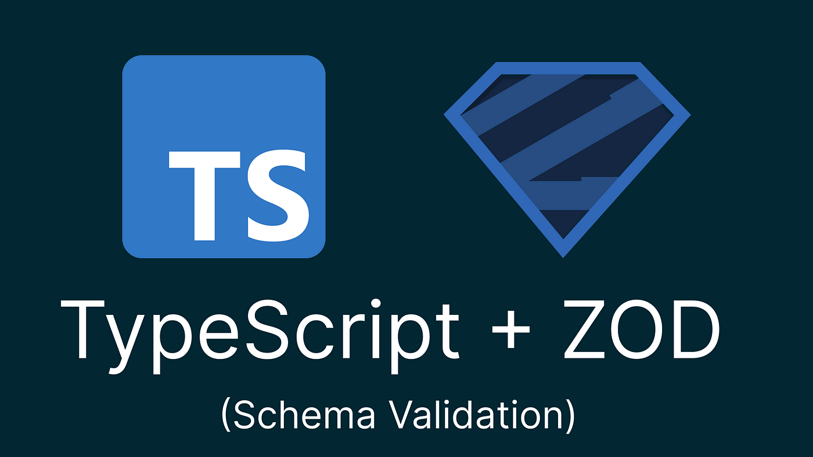

# 02 웹보안 기초상식 쌓기 part.02

이번에는 `입력값 검증 부족 (XSS, SQL Injection 등)`과 `CORS 설정 오류`에 대해 알아보고자 한다. 
`XSS`와 `SQL 인젝션`은 꽤 유명해서 몇번 들어본 웹 해킹 기법이고, `CORS`는 매번 고통받고 있어서 특히나 더 재밌을 것 같다.
두 주제 모두 웹에 있어서 중요한 보안 주제들이고, 자주 마주칠 주제들이니 이번 기회에 확실히 알고 넘어가야 겠다.


## 1. 입력값 검증 부족 (XSS, SQL Injection 등)

> 참고자료
> - [XSS(크로스 사이트 스크립트)란? 공격 유형부터 보안대책까지!](https://www.skshieldus.com/blog-security/security-trend-idx-06)
> - [OWASP XSS 소개](https://owasp.org/www-community/attacks/xss/)  
> - [OWASP SQL Injection 소개](https://owasp.org/www-community/attacks/SQL_Injection)  

**입력값 검증 부족**은 사용자로부터 입력받는 모든 데이터를 적절히 필터링·검증하지 않아, 악의적인 코드를 실행시키거나(예: XSS), DB 쿼리를 조작해 중요한 정보를 탈취·변경하는(예: SQL Injection) 등 각종 취약점을 유발할 수 있다.  
입력값 검증 미흡으로 인해 발생하는 대표적인 취약점에는 **XSS**(Cross-Site Scripting), **SQL Injection**, **Command Injection** 등이 있다.


### 1.1. XSS (Cross-Site Scripting)

XSS는 공격자가 웹 애플리케이션의 취약점을 이용해 공격용 스크립트를 삽입하고, 이를 **다른 사용자가** 열람할 때 실행되도록 하는 공격이다. 
주로 **게시판**, **메시지**, **메일** 등 여러 사용자가 공용으로 이용하는 기능에 악성 스크립트를 삽입하며, 이를 통해
- **쿠키/세션 값 탈취**  
- **키보드 입력값 탈취**  
- **악성 사이트로의 접속 유도(피싱)**  
- **임의의 JavaScript 코드 실행**  
등을 수행할 수 있어 사용자에게 직접적인 피해를 유발한다.

### 1) XSS의 예시

1. **Stored XSS (저장형)**  
  공격자가 웹 서버(DB)에 악성 스크립트를 영구적으로 저장해두고, 사용자들이 해당 페이지에 접속하면 스크립트가 실행되도록 하는 방식이다.

2. **Reflected XSS (반사형)**  
  악성 스크립트가 URL 파라미터 등에 포함되어 서버에 전송된 뒤, **즉시 응답 페이지**에 반사되어 실행되는 방식이다.  
  주로 이메일·메신저 등을 통해 악성 링크를 클릭하게끔 유도한다.

3. **DOM Based XSS (DOM 기반)**  
  서버 응답 없이 **클라이언트(브라우저) 측**에서 HTML/JS DOM 조작으로 발생하는 취약점이다.  
  `innerHTML`, `document.write` 등에 사용자 입력이 제대로 필터링되지 않은 채로 들어가면 발생하기 쉽다.

#### 2) 대응 방법

1. **입력 값 필터링**  
  - `<`, `>`, `'`, `"` 등 특수문자를 HTML 엔티티(`&lt;`, `&gt;`)로 치환해 스크립트가 동작하지 못하도록 한다.  
  - 게시판처럼 특정 태그를 허용해야 하는 경우, 허용 태그만 남기고 나머지는 제거하는 **화이트리스트 방식을 적용**한다.

2. **출력 시 인코딩(이스케이프 처리)**  
  - HTML에 사용자 입력을 다시 표시할 때, 브라우저가 스크립트로 해석하지 않도록 **모든 문자를 인코딩**한다.

3. **전용 라이브러리 활용**  
  - **Lucy-XSS-Filter**, **OWASP ESAPI** 등의 라이브러리를 사용해 악성 스크립트 삽입을 적극적으로 차단한다.

4. **CSP(Content Security Policy) 적용**  
  - `Content-Security-Policy` 헤더로 외부 스크립트 로드를 제한하거나 인라인 스크립트를 막아서, 혹여 공격이 발생하더라도 위험 범위를 줄인다.


### 1.2. SQL Injection

SQL Injection은 **SQL 쿼리를 동적으로 생성**할 때, 사용자 입력값을 무심코 포함함으로써 쿼리가 왜곡·조작되는 공격이다. 
이를 통해 DB상의 기밀 데이터를 조회하거나, 심지어 데이터를 삭제/변경하는 것도 가능해진다.


#### 1) 예시

```sql
-- 잘못된 예시: 문자열 연결로 SQL 쿼리를 만드는 경우
const userId = req.body.userId; // 예: userId = "1 OR 1=1"
const query = `SELECT * FROM Users WHERE id = '${userId}'`; 
```
사용자가 `1 OR 1=1` 등의 문자열을 입력하면 쿼리가 `SELECT * FROM Users WHERE id = '1 OR 1=1'`로 변형되어, 모든 레코드를 조회하게 된다.


#### 2) 대응 방법
1. **Prepared Statement(Parameterized Query) 사용**
  - 문자열로 SQL 구문을 직접 연결하지 않고, 파라미터 바인딩 방식(Prepared Statement)을 사용한다.
2. **ORM 사용**
  - TypeORM, Prisma 등 ORM을 활용해 자동으로 파라미터 바인딩이 적용되도록 한다.
3. **입력값 필터링/검증**
  - 데이터베이스에 허용되지 않는 문자를 철저히 검증하고, 화이트리스트 기반(허용 문법만 사용) 검증을 고려한다.


### 1.3. 입력값 검증 시 `TypeScript` + `Zod` 활용하기



서버와 클라이언트 모두에서 입력값을 검증할 때 **TypeScript**와 **Zod** 라이브러리를 활용하면 더욱 견고한 코드를 짤 수 있다.

1. **TypeScript**로 기본적인 타입 체크
- `any` 대신 구체적인 타입을 사용하면, 의도된 데이터 형태가 아닌 경우 컴파일 단계에서 오류를 확인할 수 있다.

2. **Zod**로 런타임 스키마 검증
- TypeScript는 컴파일 타임 타입 체크에만 관여하므로, 실제 런타임에서 들어오는 입력값을 100% 보장해주지 못한다.
- Zod(혹은 Yup, Joi 등)을 사용해 스키마를 정의해두고, **서버로 들어오는 파라미터와 바디 등을 런타임에** 엄격히 검사한다.

```typescript
import { z } from "zod";

const userSchema = z.object({
  userId: z.string().max(20),
  password: z.string().min(8),
});

app.post("/login", (req, res) => {
  const parseResult = userSchema.safeParse(req.body);

  if (!parseResult.success) {
    return res.status(400).json({ error: "Invalid input data" });
  }

  const { userId, password } = parseResult.data;
  // 이후 로직들...
});
```
- 이렇게 함으로써 DB 접근 전에 스키마를 만족하지 않는 데이터가 즉시 걸러지도록 할 수 있다.
- 단, **Zod**만으로 **SQL Injection**을 완벽 차단할 수 있는 것은 아니며, DB 접근 로직에서 반드시 **Prepared Statement(Parameterized Query)**나 **ORM**등을 이용하여 쿼리를 안전하게 구성해야 한다.
- 즉, **Zod**는 데이터 구조·형식 검증을 강화해줄 뿐, DB 쿼리의 안전성은 여전히 따로 보장해주어야 한다.


### 1.4. 결론

입력값 검증을 소홀히 하면 웹 애플리케이션을 뚫을 수 있는 다양한 공격 루트가 생긴다.
- DB 쿼리, 파일 경로, 스크립트 실행 등 **모든 사용자 입력 영역**(클라이언트 단)에서 공격을 대비해야 한다.
- **TypeScript** + **Zod** 같은 조합으로 컴파일 타임 & 런타임 검증을 함께 수행하면, 보다 안전하고 간결한 코드를 작성할 수 있다.
- 서버가 받는 **모든 입력값**을 의심하고, **출력 단계**에서도 인코딩 처리를 철저히 해야 피해를 줄일 수 있다. 
- 최종적으로는 서버에서 반드시 파라미터, 바디, 쿼리 스트링 등에 대한 유효성 검사를 수행해야 한다는 점을 잊지 말자.


## 2. CORS(Cross-Origin Resource Sharing) 설정 오류

> 참고자료
> - [웹개발 짜증유발자! CORS가 뭔가요?](https://youtu.be/bW31xiNB8Nc?si=Db6sMJbe1ue0acQR)
> - [MDN 교차 출처 리소스 공유(CORS)](https://developer.mozilla.org/ko/docs/Web/HTTP/Guides/CORS)
> - [CORS 에러 해결 방법, CORS 보안 취약점 예방 가이드](https://eleunadeu.tistory.com/80)


### 2.1. CORS의 등장 배경

#### 1) 동일 출처 정책(Same-Origin Policy)의 한계
- 동일 출처 정책(SOP)은 보안상의 이유로, 브라우저에서 로드된 스크립트가 **같은 출처(도메인, 스킴, 포트)**가 아닌 곳으로 요청을 보내거나 응답을 확인하지 못하도록 막는 규칙이다..
- 이 정책은 악의적인 스크립트(특히 XSS 등)가 다른 사이트의 사용자 데이터를 탈취하는 상황을 어느 정도 막아주지만, 현대 웹에서 흔히 필요한 서로 다른 도메인 간 데이터 공유에는 매우 불편한 제약이 되었다.
- 예를 들어, 특정 서비스 도메인(예: `api.example.com`)에서 데이터를 제공하고, 이를 여러 다른 도메인(예: `service.com`, `webapp.com`)에서 사용하는 구조라면, 동일 출처 정책만으로는 이런 요청이 모두 차단되어 버린다.

#### 2) 교차 출처 요청의 필요성
- 웹 애플리케이션이 **모듈화, API화, 클라우드 서비스 기반**으로 발전하면서, 서로 다른 도메인 간에 자원과 데이터를 교환하는 일이 흔해졌다.
- 예: 웹 폰트(타 도메인 CDN), 이미지/영상 등 미디어 리소스 로드, JSON API를 다른 서버에서 호출 등.
- 이처럼 합법적인 목적으로 발생하는 교차 출처 HTTP 요청을 허용하고 싶지만, 보안 위험도 동시에 줄여야 한다.
→ 따라서, **서버가 브라우저에게 "이 출처는 요청을 받아도 괜찮다"**라고 명시적으로 알려주는 표준을 만들었고, 그것이 CORS다.


### 2.2. CORS의 동작 방식

#### 1) 핵심 개념: 서버가 허용해야 브라우저가 통과시킨다
- 브라우저가 특정 스크립트(웹 페이지)로부터 교차 출처 요청을 시도하면, 서버는 CORS 관련 응답 헤더(`Ex. Access-Control-Allow-Origin`)로 이를 허용할지 말지를 판단해 브라우저에 알려준다.
- 브라우저는 서버의 허용 응답을 받지 못하면, 보안상의 이유로 해당 응답(데이터)을 스크립트에서 사용할 수 없도록 차단합니다.
- 즉, 브라우저는 단지 요청만 보냈다고 해서 결과를 무조건 받아오는 것이 아니라, **서버가 명시적으로 "접근 가능"**이라고 응답해야 JavaScript가 해당 응답을 다룰 수 있다.

#### 2) 단순 요청과 사전 요청
- **단순 요청(Simple request):**
  - `GET`, `HEAD`, `POST` 중 일부 조건(특정 `Content-Type` 등)을 만족하는 형태의 요청.
  - CORS 규칙을 지키면서도 따로 **"사전 OPTIONS 요청"**을 거치지 않아도 곧바로 서버로부터 허용 응답을 받아 처리할 수 있는 방식이다.

- **사전 요청(Preflight):**
  - 단순 요청 범위를 넘어서는 요청(`PUT`, `DELETE` 같은 메서드, 혹은 특정 커스텀 헤더 사용 등)을 보낼 때, 브라우저는 먼저 OPTIONS 메서드로 "미리 이런 요청(메서드, 헤더)을 보내도 괜찮나?"라고 서버에 묻는다.
  - 서버가 `Access-Control-Allow-Methods`, `Access-Control-Allow-Headers` 등을 통해 해당 요청 방식과 헤더를 허용한다면, 그제야 실제 요청을 보내는 구조이다.
  - 이를 통해 서버가 예측 불가능한 변경 요청을 미리 인지하고, 허용/거부를 결정할 수 있게 한다.

#### 3) 자격 증명(Credentials)이 포함된 요청
- 일반적인 CORS 요청은 보안을 위해 쿠키나 인증 정보가 자동으로 포함되지 않는다.
  그러므로 자격 증명이 필요하면 별도의 옵션을 설정해야 한다.
  - `fetch()`를 사용할 경우 `credentials` 옵션,
  - `XMLHttpRequest`를 사용할 경우 `xhr.withCredentials = true`로 설정하면, 교차 출처로 쿠키나 인증 토큰 등을 함께 전송할 수 있습니다.

- 단, 서버 쪽 응답에도 `Access-Control-Allow-Credentials: true`가 반드시 있어야 하며, 이때 `Access-Control-Allow-Origin` 값으로 *(와일드카드)는 쓸 수 없다.
반드시 구체적인 출처(`https://example.com`)를 명시해야 한다.

### 2.3 CORS 설정 오류로 인한 보안 취약점
CORS는 서버가 브라우저의 교차 출처 요청을 어느 범위까지 허용할지를 명시적으로 설정해 주는 역할을 한다.
그러나, 만약 CORS 설정을 잘못 구성하면, 원래 의도치 않게 민감한 정보가 노출되거나 공격자가 임의의 스크립트를 통해 서버에 요청할 수 있는 보안 취약점이 발생할 수 있다.

#### 1) 와일드카드(`*`) 오용

CORS에서 가장 중요한 응답 헤더 중 하나인 `Access-Control-Allow-Origin`은 **원격 서버의 리소스를 허용할 출처(Origin)**를 명시한다.
이때 보안을 위해 일반적으로는 특정 도메인을 지정해야 한다.
그러나 잘못해서 **와일드카드`*`**를 사용하면, 어느 출처든 접근을 허용한다는 의미가 된다.

특히 자격 증명(Cookies, Authorization 헤더 등)을 사용해야 하는 민감한 요청에 대해 `Access-Control-Allow-Origin`을 `*`로 설정하면 매우 위험하다.
(실제 표준/브라우저 규정상 자격 증명이 있는 요청에는 `*`를 허용하지 못하도록 되어 있지만, 서버단에서 여러 헤더를 잘못 섞어 쓰면 허용 취급되는 경우가 발생할 수 있다.)

1. **민감 정보 노출**
  - 사용자 쿠키나 세션이 필요한 API에 대해 *를 허용하면, 공격자는 임의의 웹사이트를 통해 피해자가 해당 API에 교차 출처 요청을 보내도록 유도하고, 응답 데이터를 스크립트로 가져와 탈취할 수 있다.
2. **CSRF와 결합**
- 원래 CSRF를 방어하기 위해서는 토큰 검증 등이 필요하지만, CORS를 부적절하게 허용해 두면 단순히 `fetch`나 `XMLHttpRequest`로도 원본 쿠키가 자동 전송될 수 있다. 이 상태에서 공격 사이트에서 사용자의 권한으로 API를 조작할 수 있는 우회 경로가 생기기도 한다.

그러므로, `Access-Control-Allow-Origin` 헤더가 `*`로 고정되어 있는지 확인하고, 자격 증명(쿠키, HTTP 인증 등 Credential) 기반 API라면 반드시 특정 도메인만을 지정하도록 설정해야 한다.
Origin 요청 헤더의 값을 그대로 사용하는 것도 와일드 카드와 동일한 상황이니 이 역시 조심해야 한다. 

#### 2) 동적 Origin 허용 시 주의점

어떤 서비스에서는 여러 서브도메인 또는 여러 파트너 사이트에서의 접근을 동적으로 허용해야 하는 요구 사항이 있을 수 있다. 
이때 화이트리스트(허용 목록)로 지정되지 않은 도메인에 대해서는 허용하지 않아야 한다.
특히 정규표현식으로 Origin을 검증할 경우 위험할 수 있다. 스키마(`https://`)와 포트(`:8080` 등) 포함 여부 정확히 검증해야 하며, URI 인코딩, 유니코드 등 예외 처리를 철저히 확인해야 한다.

#### 3) 개발/테스트 환경과 운영 환경 간 설정

로컬 개발(포트 `localhost:3000`)이나 QA 서버, 스테이징 서버 등등 여러 환경에서 API를 테스트할 때, 프론트엔드 개발 편의를 위해 `Access-Control-Allow-Origin: *`로 열어두는 경우가 많다.
운영 환경 배포 시에 이를 제거하거나 변경해야 하는데, 잊거나 누락해서 그대로 노출될 수 있으므로 항상 신경써야 한다.

### 2.4 결론
- CORS는 교차 출처 요청을 유연하고 안전하게 허용하기 위해 고안된 메커니즘이지만, 구성 오류가 생기면 심각한 보안 취약점으로 이어질 수 있다.
- 특히 `Access-Control-Allow-Origin: *`와 `Access-Control-Allow-Credentials: true`를 함께 쓰거나, 여러 도메인을 동적으로 허용할 때 검증이 부실한 경우 등에서 개인정보, 세션 탈취와 같은 문제가 발생할 수 있다.
- 따라서 정교한 설정(화이트리스트, 특정 도메인 지정, 꼭 필요한 메서드, 헤더만 허용), 환경별 설정 분리, 코드 리뷰 및 보안 점검을 통해 CORS가 의도대로 작동하도록 관리해야 한다.
