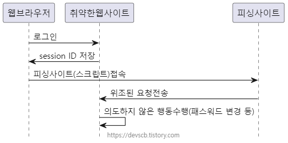

# 03 웹보안 기초상식 쌓기 part.03

## 1. CSRF 대응 미비

> 참고자료
> [CSRF란, CSRF 동작원리, CSRF 방어방법](https://devscb.tistory.com/123)
> [CSRF(크로스 사이트 요청 위조) 알아보기](https://innovation123.tistory.com/243)
> [https://sj602.github.io/2018/07/14/what-is-CSRF/](https://sj602.github.io/2018/07/14/what-is-CSRF/)

CSRF(Cross-Site Request Forgery)는 웹 보안 취약점으로, 사용자가 의도하지 않은 요청을 보내도록 유도하는 공격이다.
주로 인증된 사용자가 자신의 의지와는 무관하게 웹 애플리케이션에 공격자가 의도한 특정 요청을 보내도록 유도하는 것으로 이루어진다.
제품 구입, 자금 이체, 비밀번호 변경, 기록 삭제 등의 요청을 악의적으로 보내는 것이다.

### 공격 방법

취약한 사이트에 쿠키 세션 방식으로 로그인되어있고, 악성 스크립트 페이지에 접속 시 웹 브라우저에 의해 쿠키에 저장된 `session ID`가 함께 서버로 전송된다. 취약한 사이트의 서버는 쿠키에 담긴 `session ID`를 통해 해당 요청이 인증된 사용자로부터 온 것으로 판단하고 처리한다.

```html
<form action="https://vulnerable-website.com/password/change" method="POST">
          <input type="hidden" name="password" value="mypassword">
   </form>
<script>          
document.forms[0].submit();
</script>
```
위와 같은 형태로 이루어진 HTML문서를 열게 되면, 클릭하자마자 `mypassword`로 비밀번호 변경 요청을 서버에게 보낸다. 

```html

```

만약 요청이 `POST`등이 아닌 `GET` 형식이라면, ``태그가 포함된 글을 보기만 해도 로그아웃을 시킬 수도 있다.

### 대응 방법
#### 1) Referrer 검증
- `Request Header`에 있는 요청을 한 페이지의 정보가 담긴 Referrer 속성을 검증하여 차단
- 같은 도메인 상에서 요청이 들어오지 않는다면 차단하도록 하는 방법. (이거완전 SOP)
- 대다수의 CSRF 공격은 이 방법으로 막을 수 있다.

#### 2) Security Token(CSRF Token)
```js
// 로그인시, 또는 작업화면 요청시 CSRF 토큰을 생성하여 세션에 저장한다. 
session.setAttribute("CSRF_TOKEN",UUID.randomUUID().toString()); 

// 요청 페이지에 CSRF 토큰을 셋팅하여 전송한다 
<input type="hidden" name="_csrf" value="${CSRF_TOKEN}" />
```
- 랜덤한 수를 사용자의 세션에 저장하여 사용자의 모든 요청(Request)에 대하여 서버 쪽에서 검증하는 방법.
- 요청을 받을 때마다 백엔드에서 세션에 저장된 토큰값과 요청 파라미터에서 전달되는 토큰값이 같은지 검증하는 방법.

#### 3) Double Submit Cookie
Double Submit Cookie 방식은 한 번의 로그인 후 서버가 생성한 CSRF 토큰을 쿠키로 전달하고, 동시에 폼이나 요청 헤더 등에 토큰을 추가로 담아 전송하여, 서버 측에서 **“쿠키에 있는 토큰”과 “전송된 토큰”**을 비교함으로써 CSRF 공격 여부를 판별하는 기법이다.

1. **사용자 로그인**
  - 사용자가 웹 서비스에 로그인하면, 서버는 랜덤하게 생성된 CSRF 토큰을 발급한다.
  - 서버는 이 토큰을 쿠키에 담아 사용자에게 전달한다. (`Set-Cookie: XSRF-TOKEN=<랜덤값>; Path=/;`)
2. **CSRF 토큰의 사용**
  - 클라이언트(브라우저)는 서버가 내려준 쿠키를 저장한다.
  - 클라이언트 측 스크립트(주로 자바스크립트)나 기타 방법을 통해, 폼에 이 토큰을 숨김 필드(hidden input)나 요청 헤더(Ex. `X-CSRF-TOKEN 헤더`)로 함께 담아 서버로 전송한다.

3. **서버 측 검증**
  - 서버는 요청을 받을 때, 브라우저가 자동으로 보내는 쿠키 속 CSRF 토큰과, 폼 데이터나 요청 헤더 등에 담겨 온 CSRF 토큰이 동일한지 검증한다.
  - 토큰이 일치하면 정상적인 요청으로 간주하고 처리하며, 불일치하거나 없는 경우 CSRF 공격으로 간주하여 요청을 거부한다.

이 방법은 토큰을 서버 측 세션이 아닌 쿠키에 저장하기 때문에, 대규모 사용자에 대한 세션 저장 부담이 상대적으로 적다. 
토큰 생성 -> 쿠키/폼에 동시 보관 -> 비교 검증 과정이 명확하여 구현이 비교적 간단하다. 
다만, `HTTPOnly` 쿠키가 아니면 자바스크립트를 통해 쿠키 값에 접근할 수 있어, **XSS** 공격을 항상 고려해야 한다.


## 2. 보안 Header 우회