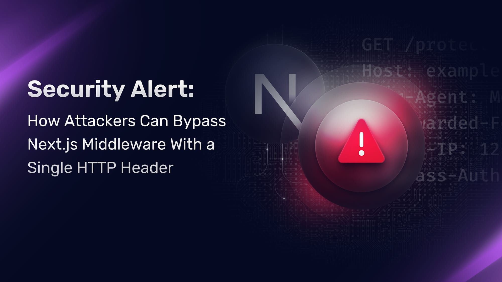

# Nextjs 취약점으로 알아보는 보안 Header 
웹 애플리케이션의 보안은 다양한 요소에 의해 좌우되며, 그 중 HTTP 보안 헤더는 중요한 역할을 합니다. 이 글에서는 일반적인 HTTP 보안 헤더의 취약점과 최근 Next.js에서 발견된 x-middleware-subrequest 헤더 취약점(CVE-2025-29927)에 대해 상세히 알아보겠습니다.

## 1. 일반적인 HTTP 보안 헤더 취약점
HTTP 보안 헤더는 웹 브라우저에게 특정 보안 정책을 지시하는 역할을 한다. 그러나 이러한 헤더가 부적절하게 설정되거나 누락되면 다양한 보안 취약점이 발생할 수 있다.

### 1) Content Security Policy(CSP) 미설정 또는 부적절한 설정
CSP는 웹 페이지에서 허용되는 콘텐츠 소스를 지정하여 `XSS(Cross-Site Scripting)` 공격을 방지한다. 
그러나, CSP가 설정되지 않았거나 부적절하게 구성되면 악성 스크립트가 삽입될 수 있다.​
공격자는 악성 스크립트를 주입하여 사용자 세션을 탈취하거나 민감한 정보를 훔칠 수 있으므로, CSP 정책을 설정하여 신뢰할 수 있는 소스만을 허용해야 한다.
예를 들어, `Content-Security-Policy: default-src 'self'; script-src 'self';`와 같이 설정할 수 있다.​

### 2) `X-Frame-Options` 헤더의 부재
이 헤더는 웹 페이지가 다른 사이트의 프레임에 포함되는 것을 제어하여 클릭재킹(clickjacking) 공격을 방지한다.​
헤더가 없으면 공격자가 사용자를 속여 악의적인 행동을 유도할 수 있다.​
`X-Frame-Options: DENY` 또는 `X-Frame-Options: SAMEORIGIN`을 설정하여 프레임 내 포함을 제한해야 한다.​

### 3) HTTP Strict Transport Security(HSTS) 미설정
HSTS는 브라우저가 해당 사이트와의 모든 통신을 **HTTPS로만 수행하도록 강제**합니다.
HSTS가 설정되지 않으면 공격자가 사용자의 연결을 HTTP로 다운그레이드하여 중간자 공격을 수행할 수 있다.​
`Strict-Transport-Security: max-age=31536000; includeSubDomains; preload`와 같이 설정하여 HTTPS를 강제해야 한다.

### 4) X-Content-Type-Options 헤더의 부재
이 헤더는 브라우저가 선언된 콘텐츠 유형을 신뢰하도록 하여 `MIME` 스니핑 공격을 방지한다.​
헤더가 없으면 브라우저가 콘텐츠를 잘못 해석하여 악성 코드를 실행할 수 있다.​
`X-Content-Type-Options: nosniff`를 설정하여 브라우저의 `MIME` 스니핑을 방지해야 한다.​

### 5) Cross-Origin Resource Sharing(CORS) 설정 오류
CORS 헤더는 다른 도메인에서 리소스에 접근할 수 있는 권한을 제어한다.​
잘못된 CORS 설정은 공격자가 사용자의 자격 증명을 도용하거나 민감한 데이터에 접근할 수 있게 한다.​
`Access-Control-Allow-Origin`을 신뢰할 수 있는 도메인으로 제한하고, 와일드카드(*) 사용을 지양해야 한다.​


## 2. Next.js의 x-middleware-subrequest 헤더 취약점(CVE-2025-29927)



### 1) 취약점 개요
Next.js는 React 기반의 풀스택 웹 애플리케이션 프레임워크로, 미들웨어 기능을 통해 요청을 처리한다. 
최근 발견된 `CVE-2025-29927` 취약점은 내부적으로 사용되는 `x-middleware-subrequest` 헤더의 부적절한 처리로 인해 발생하였다. ​

### 2) 취약점 상세 내용
Next.js는 미들웨어의 재귀 호출을 방지하기 위해 `x-middleware-subrequest`라는 내부 헤더를 사용합니다. 
이 헤더는 미들웨어가 내부적으로 요청을 보낼 때 설정되며, 이를 통해 무한 루프를 방지한다.
그러나 이 헤더의 값이 예측 가능하고 외부에서 조작이 가능하다는 점이 문제였다.
공격자는 `middleware:middleware:middleware:middleware:middleware`와 같은 값을 설정하여 미들웨어의 실행을 우회할 수 있다.

문제 코드 예시:
```js
const subreq = params.request.headers['x-middleware-subrequest'];
const subrequests = typeof subreq === 'string' ? subreq.split(':') : [];
```
위 코드는 `x-middleware-subrequest` 헤더의 값을 가져와 :로 분리하여 배열로 저장한다. 
이후 이 배열을 검사하여 재귀 호출 여부를 판단한다. 
그러나 외부에서 이 헤더를 조작하여 미들웨어를 우회할 수 있는 취약점이 존재했다. 
